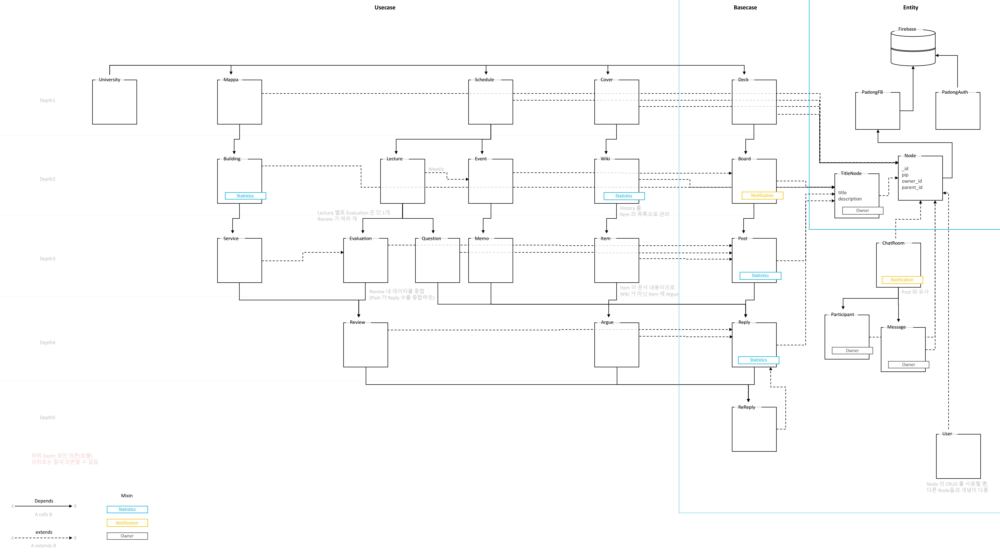

[English](./README.md) | [Korean](./README_KO.md)

## Padong

<<<<<<< HEAD
<<<<<<< HEAD
<p align="center"></p>
=======

>>>>>>> doc: Add Padong logo
=======
<p align="center"></p>
>>>>>>> doc: Compose 'Features' and 'How to use?' tab in README.md

Padong is a community platform that resolves information inequality among students in college life in the US. Padong provides successful college life know-how through asking questions and receiving back answers from senior students who have experienced and felt directly in college life.

College students make the most frequent use of the internet in their daily lives; they utilize different sources like Reddit, Quora, RateMyProfessors, Courseoff, and Facebook for various reasons. However, PADONG blends all of these together so everything is in one place. 

## Vision

‘PADONG’ means wave in Korean. We are looking to solve ‘10. Reduced Inequalities’ in [United Nations Sustainable Development Goals](https://www.un.org/sustainabledevelopment/).

We believe in the value of each person's own color and sound, the ‘human wave’. It is what we call personality or perspective.

Just like how different instruments make up an orchestra, Just like how different colors create a painter’s palette,We believe that different human waves complete the beautiful world.

But sometimes differences lead to discrimination and inequality. Therefore, as if tuning instruments to prepare a great performance, as if combining colors to complete a masterpiece, we try to make a more beautiful world by understanding each other's differences through communication.

## Mission

PADONG chose the timing of tuning as the moment when we took the first step toward becoming an adult. 
All members of the Developer Student Clubs will probably remember the moment we entered college. It is the moment when we meet people from various origins and collide with more diverse human waves.

We want to help that step be filled with hope, like warm sunlight and beautiful sound. So the targets of PADONG are not only college students but also young adults who are not going to college or are preparing to go to college.

We create the PADONG, In this way, with hope for a beautiful world. We create a platform where everyone can share their own unique perspective and create an ocean of human waves. Through PADONG, we hope every human wave will create a beautiful ripple that will have a long-lasting impact on each other's lives.

## Features

**Padong Introduction video:**

<p align="center"><a href="https://youtu.be/Fe-yTo1JdWU"></a></p>

**Padong has 5 key features:**

* Wiki

  We implemented Wiki using Markdown and Diff Algorithm(Least Common Substring). College students can log and manage information about their schools on Wiki; Thus, they can be up to date with everything that’s going on, while building a stronger sense of community. This will be a great help, especially for freshmen.
  At the same time, high school students can get a college student’s perspective about the universities that they’d like to enroll in.

  <p align="center"></p>

* Board

  The Bulletin Board is a space to share information about school life. Users can create and manage their bulletin boards as needed, naturally creating an ecosystem where everyone can communicate and exchange information.
  On the pre-made Q&A board, anyone can ask questions and get answers.Students from other schools, even outsiders, can use this Q&A board.At this point, Firebase Auth's email verification was used to confirm that the answerer is a student at that university.

  <p align="center"></p>

* Timetable

  Timetable allows students to manage their schedules and log their classes.Students can manage their week’s schedule and daily routine at a glance. We created our own Appending Input widget to register multiple time ranges for one event, making it easier to handle events that occur repeatedly (lectures, part-time jobs, etc.).
  On the Lecture of Timetable, students can review the classes they take, ask questions or even chat with other students.

  <p align="center"></p>

* Maps

  By using the Maps, students can check their favorite restaurants, parking lots, and hospitals within their campus. Thanks to the Google Maps API, we can get detailed geographic information around the campus.
  Students can check the current location and find a way using the Maps. They can also pin their favorite locations and share them with others.It can be used to store a place of their own memories in the school.

  <p align="center"></p>

* Chat

  Real-time Chat is a channel which users can communicate directly. It can be used not only for a group chat room of lecture, but also for personal communication.

  <p align="center"></p>

## Tech/framework used
- [Flutter](https://flutter.dev/)
- [Firebase](https://firebase.google.com/)

## Installation
#### Prerequisite

* Git: If you have not installed Git, you click [Git](https://git-scm.com/downloads) and install it.

#### Install Padong

To run Padong, two requirements below are needed to be installed.

* [Android Studio](https://developer.android.com/studio)
* [Flutter SDK](https://flutter.dev/docs/get-started/install)

##### Install Android Studio

1. Click the Android Studio link above, download and install.
2. Run Android Studio and install Flutter plugin.

   1. Launch **Android Studio application**.
   2. If you just installed Android Studio, Choose **Configure -> Plugins**.
      * If you are not the case, Choose **File -> Settings -> Plugins**.
   3. Search **Flutter** Plugin and install it.
   4. Restart **Android Studio application**.

##### Install Flutter SDK

1. Download Flutter SDK from Git repository:

   ```bash
   git clone https://github.com/flutter/flutter.git -b stable
   ```

2. Update your path

   * Windows

     1. From the Start search bar, enter ‘env’ and select **Edit environment variables for your account**.
     2. Under **User variables** check if there is an entry called **Path**:
        - If the entry exists, append the full path to `flutter\bin` using `;` as a separator from existing values.
        - If the entry doesn’t exist, create a new user variable named `Path` with the full path to `flutter\bin` as its value.

   * Mac

     1. Determine the directory where you placed the Flutter SDK. You need this in Step 3.

     2. Open (or create) the `rc` file for your shell. Typing `echo $SHELL` in your Terminal tells you which shell you’re using. If you’re using Bash, edit `$HOME/.bash_profile` or `$HOME/.bashrc`. If you’re using Z shell, edit `$HOME/.zshrc`. If you’re using a different shell, the file path and filename will be different on your machine.

     3. Add the following line and change `[PATH_TO_FLUTTER_GIT_DIRECTORY]` to be the path where you cloned Flutter’s git repo:

        ```bash
        export PATH="$PATH:[PATH_TO_FLUTTER_GIT_DIRECTORY]/flutter/bin"
        ```

     4. Run `source $HOME/.<rc file>` to refresh the current window, or open a new terminal window to automatically source the file.

     5. Verify that the `flutter/bin` directory is now in your PATH by running:

        ```bash
        echo $PATH
        ```

        Verify that the `flutter` command is available by running:

        ```bash
        which flutter
        ```

3. Run flutter doctor.

   ```bash
   flutter doctor
   ```

##### Clone and run Padong

1. Open a terminal and clone Padong project:

   ```bash
   git clone https://github.com/padong4284/padong-flutter.git
   ```

2. In Padong project directory, download dependencies by typing following command:

   ```bash
   flutter pub get
   ```

3. Run **Android Studio**, click **open an existing project** and open Padong's project directory.

4. In **Android Studio**, click **File -> Settings -> Languages & Frameworks** and set **Flutter SDK path** as Flutter SDK directory you have cloned.

5. On **top bar in Android Studio**, select virtual device you would like to use and run by clicking **run icon**
   **Or** build by clicking **build -> Flutter -> build APK or build IOS** and move the build output to your smart phone and install it.

## How to use?

1. Install APK or IPA file you built using Android Studio **or** Download **Padong** from App Store or Google Play.

2. Run Padong app.

3. Tap "Sign Up" button, fill out all required fields, and tap "->"(next) button on the screen.

4. Then, you will be signed in! Enjoy Padong :)

   <p align="center"></p>

## Architecture



PADONG is designed based on the Clean Architecture that follows the SOLID principle. Before designing the architecture, we analyzed the commonalities between various use cases of PADONG. (Wiki, Board, Timetable, Map, Chat) 

As a result, we realized that each use case could be represented in a tree structure. For example, the Board is a parent of Posts, and each Post has Replies as children. Based on this insight, we abstract all data structures into Node and implement use cases as interactions between nodes. So, we defined Node as the top-level component.

Each node has the parent node’s Id, and can access children using its own Id. This can be used in ways such as fetching posts from a bulletin board or fetching change logs from a wiki. Any use case similar to this can be abstracted with the getChildren function. Other CRUD business logics are also abstracted as methods inside the node. This allows each subclass of Node to focus on its own responsibility.

We chose Firestore to manage the data of Node. Because 1) Data isn’t simply stored, it can be organized into collections depending on use cases, 2) Using flexible and complex queries, we can manipulate data while taking advantage of the characteristics of Node.


On the other hand, in the user interface area, it was important to provide native performance while supporting multiple platforms.Because, the vision of PADONG is a more beautiful world that solves Reduced Inequalities. And the way to realize the vision is that many people share their own perspectives and understand each other.So, PADONG should be available to as many people as possible.

Flutter fits our purpose perfectly, and thanks to Dart is an object-oriented language, it was also suitable for implementing the Node system we designed.In addition, the documentation and ecosystem are excellent, so even though all team members are new to Flutter, we can quickly adapt and develop PADONG.

Furthermore, thanks to Flutter’s rich features, it was possible to express oscillating waves and the rotating and spreading search button. And we can maintain a simple and unified design within various features.

We were able to implement all the various features of the PADONG in just 6 weeks, thanks to Firebase, which has all the necessary infrastructure, and Flutter, which can implement both the Node system and widgets we designed.

## Future

PADONG is targeted at people in the transitional stage of adulthood. Because we hope that those people recognize the world beautifully and make a more beautiful world.

Therefore, we have prepared a separate sign-up option for people who are not attending college or who are high school students. But this is not enough for the vision of PADONG.

First, we will expand our users not only to universities in the US but also to universities around the world. After that, we intend to expand the targets. So, any group that shares the schedules, and manages the information about common interests can become the wave source. Such as high schools, companies, and local communities, etc.

Internally, we plan to make a lecture database for each semester by linking the timetable with each university’s database. And we will reinforce the search service to manage data that will increase.
Furthermore, not only lectures but also events will be shared,so that non-university communities can manage a common schedule.

In addition, we are preparing to support local used trading by connecting the review system and chat that currently exists in PADONG and using Google Maps.We hope it helps people trade things in a sustainable way.

We have made detailed monthly plans. The beta version will be uploaded to the store until March 31, the deadline for the Solution Challenge. 
Then, by April, we will resolve all issues registered on GitHub.Since Flutter 2.0 supports Web Application, we can plan to expand to the web. 
In May, we plan to add the second-hand trading service that is currently in development and strengthen the search engine. 
In June, we plan to link the timetable and each university’s database. 
From July, we will expand the service step by step while improving the service according to the feedback.

Ultimately, PADONG will create a world where no one is marginalized due to information inequalities.

## Padong Team Members
|      Name     |      GitHub   |    Email    |
|:-------------:|:-------------:|:-----------:|
|**Taejun Jang**| [jtjun](https://github.com/jtjun)     | jtjun7132@gmail.com |
|  Daewoong Ko  | [kodw4284](https://github.com/kod4284)      | kodw4284@gmail.com |
|  Hyunsik Kim  | [Devconf](https://github.com/Devconf)       | devconf5296@gmail.com |
|  Sengbin Hung | [VertexToEdge](https://github.com/VertexToEdge)  | vertextoedge@gmail.com |

## Copyright

Copyright (C) 2021-2021 Taejun Jang \<<padong4284@gmail.com>\> - All Rights Reserved.

PADONG can not be copied and/or distributed without the express permission of Taejun Jang, Daewoong Ko, Hyunsik Kim, Seongbin Hong
