[English](./README.md) | [Korean](./README_KO.md)

## 파동 (Padong)

<p align="center"></p>

<p align="center"></p>
<table>
        <tbody>
		<tr>
			<td>
                		<a href="https://play.google.com/store/apps/details?id=app.padong"></a>
              		</td>
              <td>
                <a href=""></a>
              </td>
	   </tr>
	</tbody>
</table>

파동은 궁극적으로 미국 대학에 발생하는 정보 불평등을 해소하기 위한 대학 커뮤니티 플랫폼입니다. 파동은 학교에서 제공하는 형식적인 정보가 아니라 소통의장을 통해 직접 경험하고 느낀 상급생들에게 질문과 답변을 통해서 성공적인 대학생활의 노하우를 제공합니다. 또한 기존에 파편화된 서비스들의 기능들을 통합한 서비스를 제공함으로써 파동 앱 하나로 누릴 수 있습니다. 

예를들면,

* 자신의 수업 스케줄이 감당할 수 있는 수준인지 "[Reddit](https://www.reddit.com/)" 스레드에 물어보는것
* 강의실이 있는 건물의 위치를 "Google Map" 에서 찾는 것
* 중고계산기를 [페이스북 중고장터](https://www.facebook.com/groups/199456403537988/)에서 구입하는 것
* 교수들의 평가를 "[Rate My Professors](https://www.ratemyprofessors.com/)"에 검색하는 것
*  "[Courseoff](https://courseoff.com/)"를 통해 자신의 수업을 조회하고 시간표를 작성하는 것

이렇게 파편화된 서비스를 이용할 필요 없이 대학생활에서 유용한 서비스의 기능들을 파동 하나에 담았습니다.


##  :pushpin: 파동을 만들게 된 동기

**파동의 Golden Circle**

>**Why**
>사람마다 저마다의 선, 아름다움이 있다.
>
>**How**
>각각의 선과 아름다움, 고유의 파동을 이어서
>
>**What**
>세상을 더 아름답게 만들자

미국 대학교는 OT, 어드바이저 등을 통하여 신입생들이 학교생활에 적응할 수 있는 프로그램들을 제공하지만 실질적으로 가장 도움이 되는 것은 학교생활이나 수업 들을 직접 경험하고 느껴본 상급생들입니다. 미국 대학교에서 유학생으로 생활하면서 막 입학한 1학년들이 부족한 정보로 인해 자신이 감당하지 못할 수업 스케줄 때문에 Fail 하고 결국 자퇴하는 경우를 여럿 보았습니다. 하지만 저는 한국 학생회의 상급생들을 도움을 받으면서 잘 가르치는 교수님의 수업을 알 수 있었고 강의 시간표가 무리한지 아닌지 판단할 수 있어서 학업적으로 성공해왔습니다. 이러한 저의 경험을 바탕으로 학교생활에 적응하기 힘들어하는 학생들에게 경험 많은 상급생들을 연결해 줄 플랫폼 "Padong"을 구상하게 되었습니다.

## :hammer_and_wrench: 사용한 기술과 프레임워크

- [Flutter](https://flutter.dev/)
- [Firebase](https://firebase.google.com/)

## :triangular_flag_on_post: 특징

**파동 소개영상:**

[](https://youtu.be/Fe-yTo1JdWU)

**파동은 크게 5가지의 특징으로 구성되어 있습니다.**
### :books: Wiki
  <table>
        <tbody>
		<tr>
		      <td width="25%" colspan=3>
			<p>위키에서는 대학생들이 자신이 다니는 학교의 정보를 기록하고 관리할 수 있습니다. 이를 통해 자신의 학교에 대한 정보와 애교심을 얻을 수 있습니다. 나아가 고등학생들은 자신이 가고 싶은 대학의 생생한 정보를 얻을 수 있습니다.</p>
		      </td>
         	 </tr>
          <tr>
              <td width="33%">
                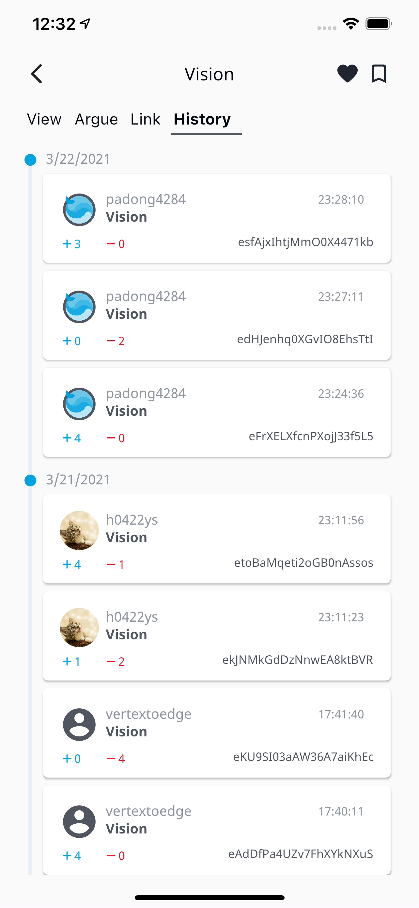
              </td>
              <td width="33%">
                
              </td>
              <td width="33%">
                
              </td>
	   </tr>
	</tbody>
</table>

### :memo: Board
  <table>
        <tbody>
		<tr>
		      <td width="25%" colspan=3>
			<p>게시판에서는 대학생들끼리 정보를 공유하고 서로의 고민을 들어줄 수 있습니다. 별도로 만들어진 질문 게시판에서는 누구나 질문을 하고 각 대학교 학생들의 답변을 받을 수 있습니다. 각자 자신만의 관점들을 제시하면서 서로에게 다른 인사이트를 줄 것입니다.</p>
		      </td>
         	 </tr>
          <tr>
              <td width="25%">
                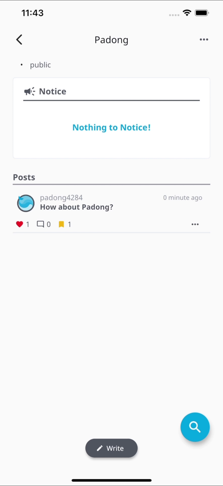
              </td>
              <td width="25%">
                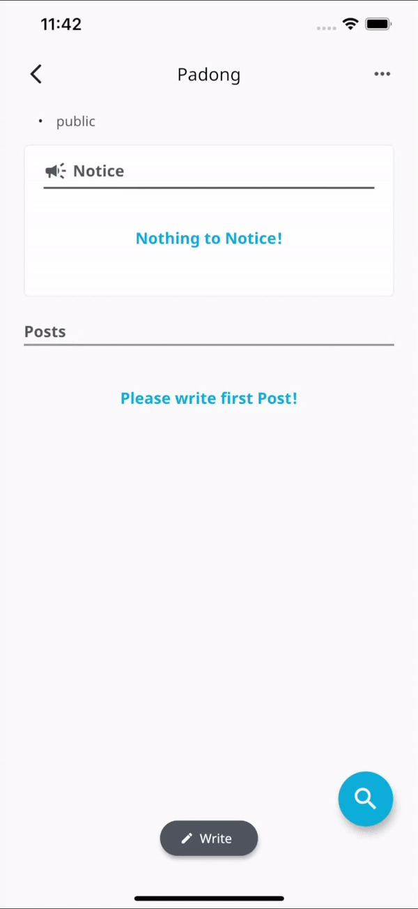
              </td>
              <td width="25%">
                
              </td>
          </tr>
	</tbody>
</table>

### :clock2: Timetable
  <table>
        <tbody>
		<tr>
		      <td width="25%" colspan=3>
			<p>시간표에서는 각자 자신의 이벤트를 관리하거나, 수강 중인 강의를 등록할 수 있습니다. 강의는 게시판과 비슷한 형식으로 운영되며,수강하고 있는 강의에 질문 및 리뷰를 남길 수 있고 수강생들끼리 채팅을 할 수도 있습니다.</p>
		      </td>
         	 </tr>
          <tr>
              <td width="25%">
                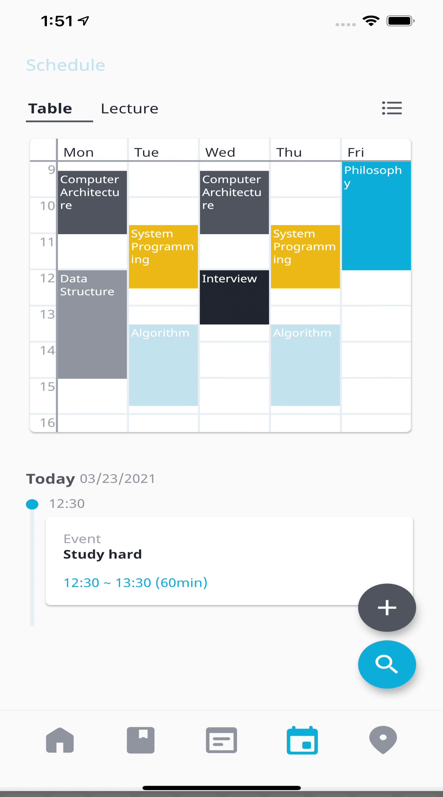
              </td>
              <td width="25%">
                
              </td>
              <td width="25%">
                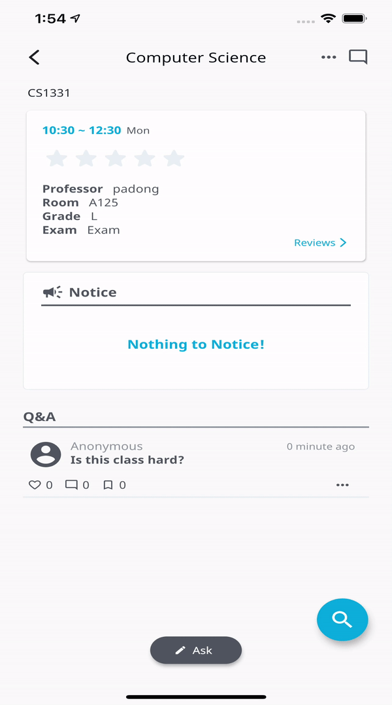
              </td>
          </tr>
	</tbody>
</table>

### :earth_asia: Maps
  <table>
        <tbody>
				<tr>
		      <td width="25%" colspan=3>
			<p>지도에서는 학교내의 식당, 주차장, 병원 등 위치 정보를 확인 할 수 있습니다. 나아가 자신만의 pin 을 지정하고 등록하고 공유할 수 있습니다.</p>
		      </td>
         	 </tr>
          <tr>
              <td width="25%">
                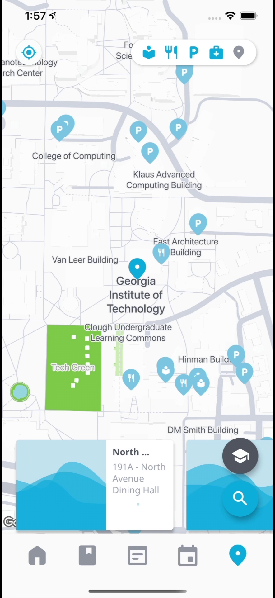
              </td>
              <td width="25%">
                
              </td>
              <td width="25%">
                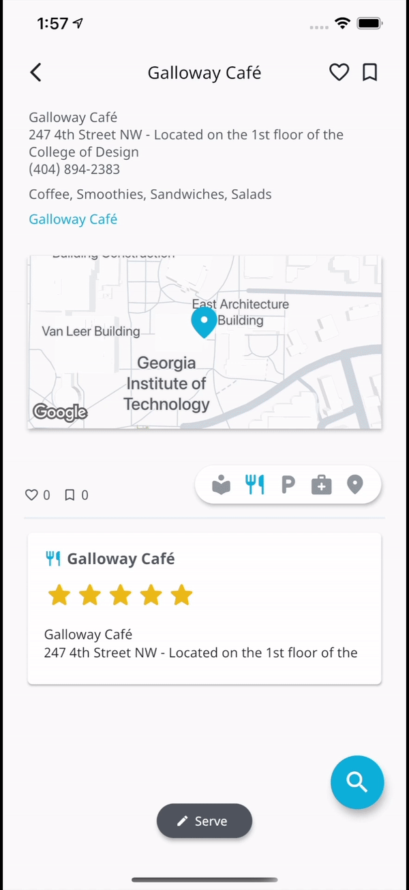
              </td>
          </tr>
	</tbody>
</table>

### :speech_balloon:Chat
  <table>
        <tbody>
						<tr>
		      <td width="25%" colspan=3>
			<p>다른 사람의 프로필을 클릭하고 "be friend" 버튼을 클릭하여 친구요청을 보낼수있습니다. 상대방이 신구요청을 수락한다면 서로 채팅을 할 수 있게 되며 어떤 질문이든 할 수 있습니다.</p>
		      </td>
         	 </tr>
          <tr>
              <td width="25%">
                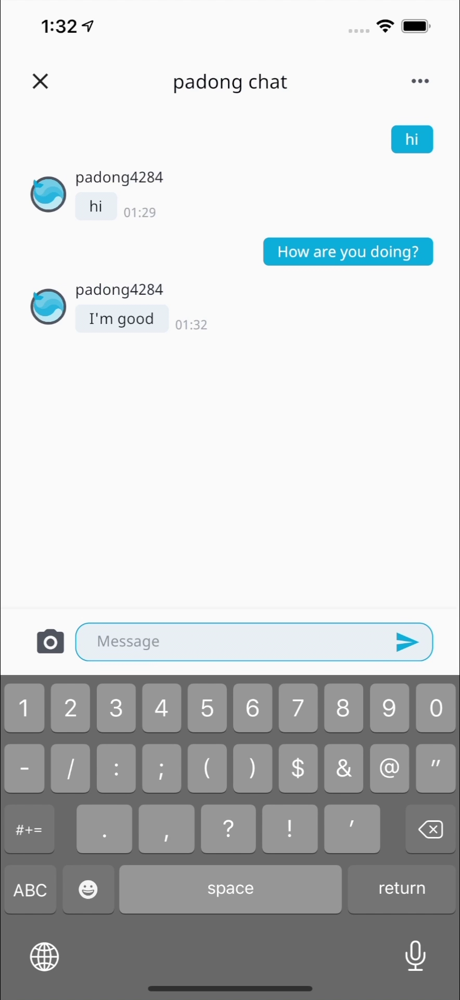
              </td>
              <td width="25%">
                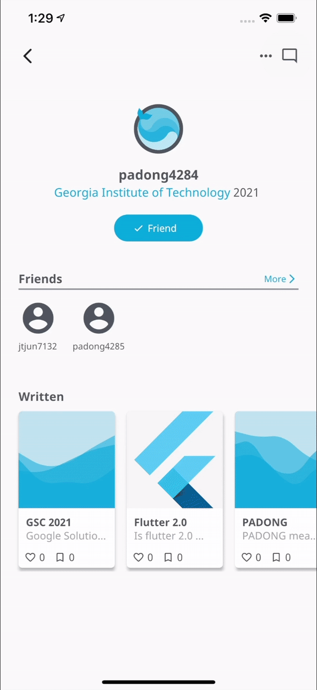
              </td>
              <td width="25%">
                
              </td>
          </tr>
   </tbody>
</table>


## :bulb: Class Diagram

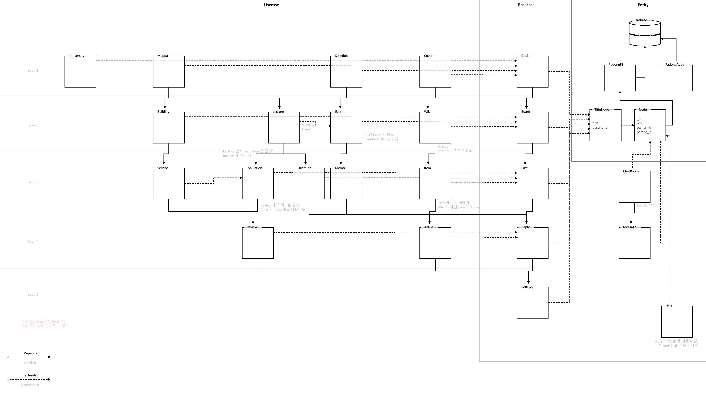


(click to see original image)

## :art: View Structure

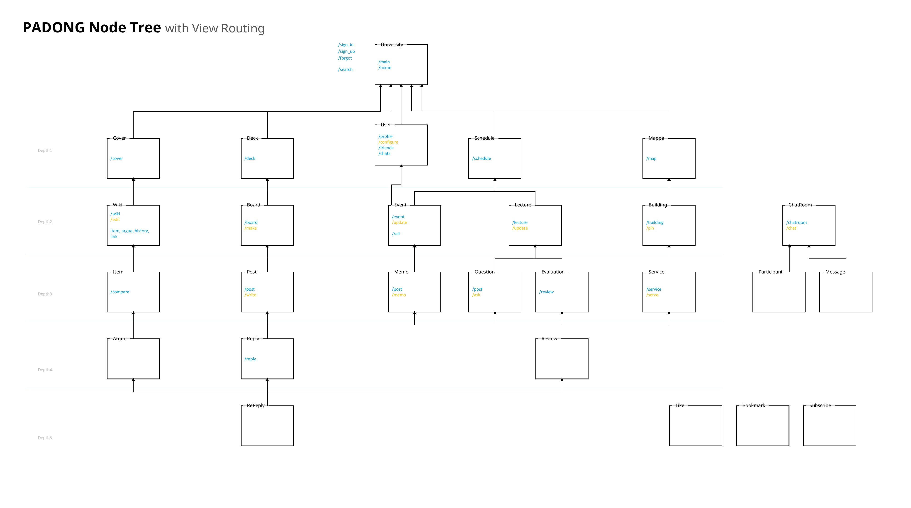

(click to see original image)


## :bank: 설치방법

#### :tropical_drink: 미리 설치되어 있어야 할 것

* Git: 깃(Git)이 설치되어 있지 않다면 해당 링크([Git](https://git-scm.com/downloads))를 클릭하여 설치합니다.

#### :toolbox: 파동 설치하기

파동을 실행하기 위해서 두 가지의 프로그램이 설치되어야합니다.

* [Android Studio](https://developer.android.com/studio)
* [Flutter SDK](https://flutter.dev/docs/get-started/install)

##### :toolbox: Android Studio 설치하기

1. 위의 **Android Studio** 설치 링크를 클릭하여 다운로드 및 설치합니다.
2. **Android Studio**를 설치하고. **Flutter** 플러그인을 설치합니다.
   1. **Android Studio**를 실행합니다.
   2. 지금 막 **Android Studio**를 새로 설치했다면, **Configure -> Plugins** 를 클릭합니다.
      * 이전부터 **Android Studio**를 사용해왔다면, **File -> Settings -> Plugins** 를 클릭합니다.
   3. **Flutter** 플러그인을 검색하고 설치합니다.
   4. **Android Studio**를 재시작 합니다.

##### :toolbox: Flutter SDK 설치

1. Git 레포지토리에서 Flutter SDK를 클론합니다:

   ```bash
   git clone https://github.com/flutter/flutter.git -b stable
   ```

2. path 환경변수를 업데이트 합니다.

   * Windows

     1. 시작버튼 옆에있는 서치바에서, ‘시스템 환경 변수 편집’를 검색 및 클릭하고 '환경변수'를 클릭합니다.
     2. 유저에 대한 사용자 변수 아래에 **Path** 변수를 확인합니다:
        - 해당 변수가 존재하면  `flutter\bin` using `;` 를 경로 맨 끝에 붙여넣습니다.
        - 해당 변수가 존재하지 않으면, Path`라는 이름의 새로운 사용자 변수를 생성하고  `flutter\bin` 를 경로 맨 끝에 붙여넣습니다.

   * Mac

     1. 자신의 디렉토리에 Flutter SDK가 있는지 확인합니다. Step 3에서 이것이 필요합니다.

     2. 자신의 쉘에 해당하는 `rc` 파일을 생성하거나 엽니다.  `echo $SHELL` 를 터미널에 입력하여 자신이 어떤 종류의 쉘을 사용하는지 확인합니다. Bash를 사용한다면, `$HOME/.bash_profile` or `$HOME/.bashrc`을 수정합니다. Z shell을 사용한다면, `$HOME/.zshrc`을 수정합니다. 다른 종류의 쉘을 사용한다면, 파일 경로와 파일 이름은 위와 다를 것입니다.

     3. 아래의 코드를 복사 붙여넣기 하고 `[PATH_TO_FLUTTER_GIT_DIRECTORY]` 부분을 Flutter의 git 레포지토리 경로로 바꿉니다:

        ```bash
        export PATH="$PATH:[PATH_TO_FLUTTER_GIT_DIRECTORY]/flutter/bin"
        ```

     4. `source $HOME/.<rc file>`을 실행하여 현재 윈도우를 새로고침 하거나, 새로운 터미널을 열어 자동으로 파일을 로드하게 합니다.

     5. 아래의 명령어를 터미널에 입력하여 `flutter/bin` 디렉토리가 PATH 환경변수에 존재하는지 확인합니다:

        ```bash
        echo $PATH
        ```

        아래의 명령어를 터미널에 입력하여 `flutter` 커맨드가 작동 가능한지 확인할 수 있습니다:

        ```bash
        which flutter
        ```

3. flutter doctor 를 실행합니다:

   ```bash
   flutter doctor
   ```

##### :cd: Padong 클론 및 실행

1. 터미널을 열고 아래의 명령어를 입력하여 파동 프로젝트를 클론합니다:

   ```bash
   git clone https://github.com/padong4284/padong-flutter.git
   ```

2. 파동 프로젝트 디렉토리에서 아래의 명령어를 입력하여 플러터 디펜던시들을 다운로드합니다:

   ```bash
   flutter pub get
   ```

3. **Android Studio** 실행하고, **open an existing project**를 클릭하고 파동 프로젝트 디렉토리를 엽니다.

4. **Android Studio**에서, **File -> Settings -> Languages & Frameworks**순으로 클릭하고 **Flutter SDK path**를 기존에 클론했던 Flutter SDK 디렉토리로 설정합니다.

5. **Android Studio** 상단바에서 원하는 가상 디바이스를 선택하고 실행 아이콘을 클릭하여 실행하거나,
   **build -> Flutter -> build APK or build IOS**를 클릭하여 빌드한뒤 빌드결과물을 스마트폰에 옮겨 설치합니다.

## :cake: 사용방법

1. Android Studio를 사용하여 빌드한 APK or IPA 파일을 설치하거나 **파동(Padong)**을 App Store 혹은 Google Play에 검색하여 설치합니다.

2. 파동앱을 실행합니다.

3. "Sign Up" 버튼을 탭하고, 화면에 있는 필드들을 작성하고, "->"(다음) 버튼을 클릭합니다.

4. 회원가입이 완료된 후 파동을 즐겨주세요:)

   <p align="center">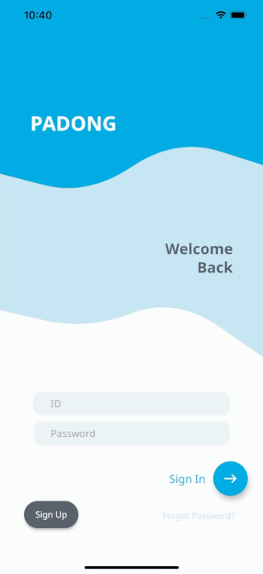</p>


## 🇰🇷 PADONG Team Members
|      Name     |      GitHub   |    Email    |
|:-------------:|:-------------:|:-----------:|
|**Taejun Jang**| <a href="https://github.com/jtjun"></a> | <a href="mailto:jtjun7132@gmail.com"></a> |
|  Daewoong Ko  | <a href="https://github.com/kod4284"></a> | <a href="mailto:kodw4284@gmail.com"></a> |
|  Hyunsik Kim  | <a href="https://github.com/Devconf"></a> | <a href="mailto:devconf5296@gmail.com"></a> |
|  Sengbin Hung | <a href="https://github.com/VertexToEdge"></a> | <a href="mailto:vertextoedge@gmail.com"></a> |


## :copyright: Copyright

Copyright (C) 2021-2021 Taejun Jang \<<padong4284@gmail.com>\> - All Rights Reserved.

PADONG can not be copied and/or distributed without the express permission of Taejun Jang, Daewoong Ko, Hyunsik Kim, Seongbin Hong
